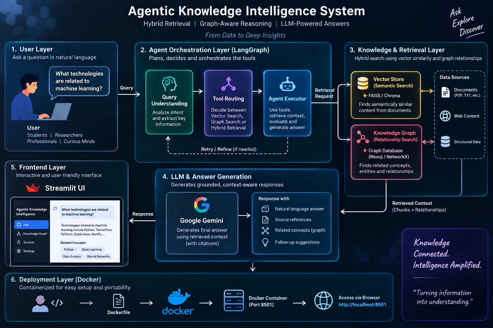

# 🤖 Agentic Knowledge Intelligence System

### Hybrid RAG + Knowledge Graph + LangGraph + Gemini + MCP

An AI-powered knowledge intelligence system that combines **semantic vector retrieval**, **knowledge graph reasoning**, and **agentic orchestration** to generate grounded answers from a controlled knowledge base.

The system is designed to retrieve relevant evidence, understand relationships between concepts, evaluate retrieval quality, retry weak retrieval, and generate a context-grounded response using Google Gemini.

---

## 🏗️ System Architecture



### High-Level Flow

```text
User Query
    ↓
LangGraph Agent
    ↓
Query Understanding
    ↓
Tool / Route Selection
    ↓
 ┌───────────────────────┐
 │                       │
Vector RAG          Knowledge Graph
 │                       │
FAISS               NetworkX
 │                       │
 └──────────┬────────────┘
            ↓
     Retrieved Evidence
            ↓
    Evidence Evaluation
            ↓
   Self-Correction Retry
      (if evidence is weak)
            ↓
       Google Gemini
            ↓
   Grounded Final Answer
            ↓
       Streamlit UI


🎯 Problem Statement

Traditional knowledge assistants often rely only on keyword or semantic search.

This can make it difficult to:

retrieve information based on relationships between concepts
combine document evidence with structured relationships
detect weak retrieval results
avoid generating unsupported answers
provide visibility into how an answer was produced

This project addresses these challenges using an agentic hybrid retrieval architecture.


💡 Solution

The system combines two complementary retrieval strategies:

🔹 Vector Retrieval

Documents are:

loaded from the knowledge base
split into chunks
converted into embeddings using Sentence Transformers
indexed using FAISS
searched using semantic similarity

This allows the system to retrieve information even when the user's wording differs from the source document.


🔹 Knowledge Graph Retrieval

A NetworkX knowledge graph stores relationships between entities and concepts.

For example:

Machine Learning
 ├── Artificial Intelligence
 ├── Data Science
 ├── Python
 ├── PyTorch
 ├── TensorFlow
 ├── Cloud Computing
 └── Training

This allows the system to answer relationship-oriented questions.


🔹 Hybrid Agentic Retrieval

LangGraph determines the retrieval path based on the user's query.

Question
   ↓
Query Router
   ↓
 ┌───────────────┐
 │               │
Vector          Hybrid
Search          Search
 │               │
 │          Knowledge Graph
 │               +
 │          Vector Retrieval
 └───────┬───────┘
         ↓
 Evidence Evaluation


🧠 Agentic Workflow

The agent is implemented using LangGraph.

The workflow contains:

Query Router
Vector Search
Knowledge Graph Search
Evidence Evaluator
Retrieval Retry
Context Builder
Gemini Answer Generator
Self-Correction

The system evaluates the quality of retrieved evidence.

If the retrieval score is weak, the agent automatically refines the query and performs another retrieval attempt.

Initial Retrieval
       ↓
Evidence Evaluation
       ↓
   ┌───┴────┐
   │        │
  Good     Weak
   │        │
   ↓        ↓
Generate   Refine Query
Answer        ↓
              Retry
                ↓
          Generate Answer

This provides a basic self-correcting retrieval loop rather than blindly generating an answer from the first search result.


🔐 Grounded Answer Generation

Google Gemini is instructed to generate answers only from the retrieved context.

If the knowledge base does not contain sufficient information, the system can respond:

"The available knowledge base does not contain enough information."


This helps reduce unsupported responses.

🔌 MCP Integration

The project exposes retrieval capabilities as Model Context Protocol (MCP) tools.

Available MCP Tools
search_documents(query)

Searches the vector knowledge base and returns relevant document evidence.

search_knowledge_graph(entity)

Searches the knowledge graph for related entities and relationships.

MCP provides a standardized tool interface that can be connected to compatible AI agent clients.


🖥️ Streamlit Interface

The Streamlit interface provides visibility into the agent's decision process.

It displays:

🤖 Agent Answer
🔀 Agent Decision
📊 Evidence Evaluation Score
🔗 Knowledge Graph Relationships
📚 Retrieved Sources
🔄 Retrieval Self-Correction Status
⚙️ System Component Status


Example pipeline shown in the UI:

User Query
    ↓
Agent Router
    ↓
Vector RAG / Knowledge Graph
    ↓
Evidence Evaluation
    ↓
Gemini
    ↓
Grounded Answer


🧪 Evaluation

The project includes a small handcrafted retrieval evaluation suite containing 5 test questions covering:

Annual paid leave
Service leave
Technical training
Password security
Machine learning technologies
Result
Tests passed: 5/5
Evaluation accuracy: 100.0%

The result represents a keyword-match retrieval criterion across the five handcrafted test cases, not a general benchmark of overall factual accuracy.

The project also includes an unknown-question test to verify that the system can identify insufficient knowledge rather than inventing a policy answer.


🛠️ Technology Stack

Technology	Purpose
Python	Core development
LangGraph	Agent orchestration
LangChain	AI/RAG ecosystem
Sentence Transformers	Text embeddings
FAISS	Vector similarity search
NetworkX	Knowledge graph
Gemini	LLM answer generation
MCP	Tool interoperability
Streamlit	User interface
Docker	Containerization
NumPy	Numerical operations
PyPDF	PDF document ingestion


📂 Project Structure
agentic-knowledge-intelligence/
│
├── app/
│   ├── agent/
│   │   ├── evaluator.py
│   │   ├── graph.py
│   │   └── graph_backup.py
│   │
│   ├── knowledge_graph/
│   │   └── graph_store.py
│   │
│   ├── llm/
│   │   └── gemini.py
│   │
│   ├── rag/
│   │   ├── embeddings.py
│   │   ├── ingest.py
│   │   ├── retriever.py
│   │   └── vector_store.py
│   │
│   └── tools/
│
├── data/
│   └── documents/
│       └── company_policy.txt
│
├── docs/
│   └── architecture.png
│
├── frontend/
│   └── app.py
│
├── mcp_server/
│   └── server.py
│
├── tests/
│   └── evaluation.py
│
├── Dockerfile
├── .dockerignore
├── .gitignore
├── requirements.txt
└── README.md


🚀 Getting Started

1. Clone the repository
git clone https://github.com/AmoghKUrs25/Project-Agentic-Knowledge-Intelligence.git
cd Project-Agentic-Knowledge-Intelligence

2. Create a virtual environment
python -m venv venv

Activate it on Windows:

.\venv\Scripts\Activate.ps1

3. Install dependencies
pip install -r requirements.txt

4. Configure Gemini API Key

Create a .env file:

GEMINI_API_KEY=your_api_key_here

Never commit the .env file or expose your API key publicly.


▶️ Run the Application

Start the Streamlit application:

streamlit run frontend/app.py

Open:

http://localhost:8501


🐳 Run with Docker

Build the Docker image:

docker build -t agentic-knowledge-intelligence:1.0 .

Run the application:

docker run --rm --env-file .env -p 8501:8501 agentic-knowledge-intelligence:1.0

Then open:

http://localhost:8501

The application has been tested successfully inside a Docker container.


🔬 Example Queries

Vector RAG Query
What is the annual paid leave allowance?

The system retrieves relevant company-policy evidence and generates a grounded response.

Hybrid Retrieval Query
What technologies are related to machine learning?

The agent uses:

Knowledge Graph + Vector RAG

to retrieve both relationships and supporting document evidence.

Unknown Knowledge Query
What is the company policy for pet insurance?

When sufficient evidence is unavailable, the system is designed to avoid inventing an answer.


⭐ Key Features
🧠 Agentic workflow using LangGraph
🔎 Semantic vector search using FAISS
🔗 Relationship-aware retrieval using NetworkX
🔀 Hybrid vector + graph retrieval
📊 Evidence quality evaluation
🔄 Automatic retrieval retry
🤖 Google Gemini grounded generation
🔌 MCP retrieval tools
📚 Source-aware responses
🛡️ Insufficient-evidence handling
🖥️ Interactive Streamlit dashboard
🐳 Dockerized deployment
🧪 Retrieval evaluation suite
🔮 Future Improvements


Potential extensions include:

persistent vector database
larger document collections
automatic knowledge graph extraction
richer entity and relationship extraction
improved retrieval evaluation metrics
reranking models
conversational memory
multi-agent collaboration
authentication and access control
production deployment
observability and tracing


👨‍💻 Author

Amogh K Urs

Computer Science & Engineering Student
Focused on AI Agents, RAG, LLM Applications and Software Development.

Areas of Interest
Agentic AI
Retrieval-Augmented Generation
Large Language Models
Knowledge Graphs
AI Application Development
Backend Development
DevOps


📌 Project Highlights
LangGraph       → Agent Orchestration
FAISS           → Semantic Retrieval
NetworkX        → Knowledge Graph
MCP             → Tool Integration
Gemini          → Grounded Generation
Streamlit       → Interactive UI
Docker          → Containerized Deployment
